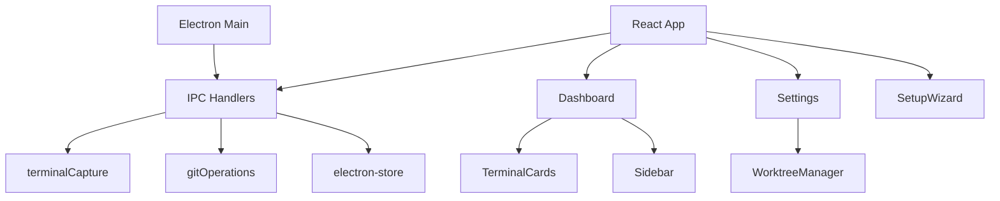

# Terminal Vibe - Project Context

## What is this?

Terminal Vibe is an Electron desktop app for monitoring multiple terminal agents working in parallel. It provides real-time terminal screenshots, git worktree management, and audio notifications.

## Tech Stack

- **Electron 28** - Desktop app framework
- **React 18** - UI components
- **Vite 5** - Build tool
- **Tailwind CSS** - Styling
- **electron-store** - Persistent storage
- **Mermaid.js** - Architecture diagrams
- **Web Audio API** - Notification sounds

## Project Structure

```
terminal-vibe/
├── electron/           # Main process
│   ├── main.js         # Entry point, IPC handlers
│   ├── terminalCapture.js  # Screen capture
│   └── gitOperations.js    # Git CLI wrapper
├── src/
│   ├── App.jsx         # Root component
│   ├── index.css       # All styles
│   └── components/     # React components
├── docs/
│   ├── ARCHITECTURE.md # System design
│   └── ROADMAP.md      # Feature roadmap
└── .claude/
    ├── commands/       # Slash commands
    ├── agents/         # Agent definitions
    └── sessions/       # Progress logs
```

## Running the App

```bash
npm install
npm run dev
```

## Key Files to Know

- `electron/main.js` - All IPC handlers live here
- `src/App.jsx` - Central state management
- `src/index.css` - All CSS (~1700 lines)
- `src/components/Settings.jsx` - Tabbed settings with worktree manager

## Current State

**Version:** 0.3.0
**Status:** MVP Complete

Features working:
- Terminal screenshot capture
- Git worktree management
- Setup wizard
- Audio notifications
- Mermaid diagrams

## Common Tasks

### Add a new IPC handler
1. Add handler in `electron/main.js`
2. Call via `ipcRenderer.invoke('handler-name', args)` in React

### Add a new component
1. Create in `src/components/`
2. Import in parent component
3. Add styles to `src/index.css`

### Modify project config
1. Update default in `electron/main.js` (get-project-config handler)
2. Update DEFAULT_CONFIG in `src/App.jsx`
3. Use in components via props

## Architecture Diagram


