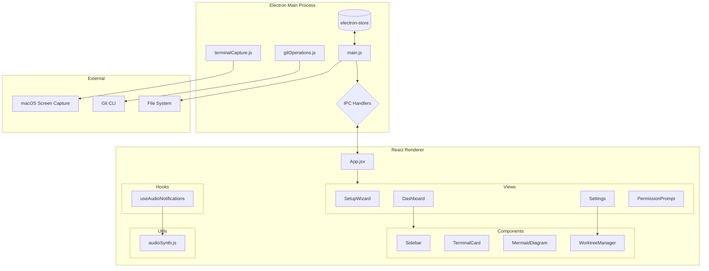

# Terminal Vibe Architecture

## System Overview

Terminal Vibe is an Electron-based dashboard for monitoring multiple terminal agents working in parallel, with git worktree management for branch-based workflows.

---

## Architecture Diagram



---

## Component Architecture

```
src/
├── App.jsx                     # Root component, state management
├── index.css                   # Global styles (~1700 lines)
│
├── components/
│   ├── Dashboard.jsx           # Main grid view
│   ├── Settings.jsx            # Tabbed settings panel
│   ├── TerminalCard.jsx        # Agent/terminal display card
│   │
│   ├── Setup/
│   │   ├── SetupWizard.jsx     # 4-step onboarding
│   │   ├── RepositoryPicker.jsx
│   │   └── ContextImporter.jsx
│   │
│   ├── Worktree/
│   │   ├── WorktreeManager.jsx
│   │   ├── WorktreeCard.jsx
│   │   └── CreateWorktreeModal.jsx
│   │
│   ├── Sidebar/
│   │   ├── Sidebar.jsx
│   │   ├── MermaidDiagram.jsx
│   │   └── ContextMonitor.jsx
│   │
│   ├── Terminal/
│   │   ├── TerminalTitleBar.jsx
│   │   ├── TerminalPreview.jsx
│   │   └── TerminalInfo.jsx
│   │
│   └── Permissions/
│       └── PermissionPrompt.jsx
│
├── hooks/
│   └── useAudioNotifications.js
│
└── utils/
    └── audioSynth.js

electron/
├── main.js                     # Electron entry, IPC handlers
├── terminalCapture.js          # Screen capture API
├── gitOperations.js            # Git CLI wrapper
└── icon.png                    # Tray icon
```

---

## Data Flow

```
┌─────────────────────────────────────────────────────────────┐
│                        USER ACTIONS                          │
└─────────────────────────────────────────────────────────────┘
                              │
                              ▼
┌─────────────────────────────────────────────────────────────┐
│                     React Components                         │
│  ┌─────────────┐  ┌─────────────┐  ┌─────────────────────┐ │
│  │ SetupWizard │  │  Dashboard  │  │      Settings       │ │
│  └─────────────┘  └─────────────┘  └─────────────────────┘ │
└─────────────────────────────────────────────────────────────┘
                              │
                    ipcRenderer.invoke()
                              │
                              ▼
┌─────────────────────────────────────────────────────────────┐
│                    Electron Main Process                     │
│  ┌──────────────────────────────────────────────────────┐  │
│  │                    IPC Handlers                       │  │
│  │  • get-project-config    • select-repository         │  │
│  │  • save-project-config   • list-branches             │  │
│  │  • get-terminal-windows  • create-worktree           │  │
│  │  • check-screen-permission • import-files            │  │
│  └──────────────────────────────────────────────────────┘  │
└─────────────────────────────────────────────────────────────┘
                              │
            ┌─────────────────┼─────────────────┐
            ▼                 ▼                 ▼
     ┌────────────┐   ┌────────────┐   ┌────────────┐
     │electron-   │   │ Git CLI    │   │ macOS      │
     │store       │   │ (worktrees)│   │ Screen Cap │
     └────────────┘   └────────────┘   └────────────┘
```

---

## IPC API Reference

### Terminal Capture
| Handler | Description |
|---------|-------------|
| `check-screen-permission` | Check macOS screen recording permission |
| `open-screen-preferences` | Open System Preferences |
| `get-terminal-windows` | Get list of terminal windows with thumbnails |
| `capture-terminal` | Capture specific terminal at higher resolution |

### Project Config
| Handler | Description |
|---------|-------------|
| `get-project-config` | Load config from electron-store |
| `save-project-config` | Persist config to electron-store |

### Git Operations
| Handler | Description |
|---------|-------------|
| `select-repository` | Open folder dialog, validate git repo |
| `get-repo-info` | Get repo metadata (name, branch, remote) |
| `list-branches` | List all local and remote branches |
| `list-worktrees` | List existing worktrees |
| `create-worktree` | Create new worktree from branch |
| `remove-worktree` | Delete a worktree |
| `prune-worktrees` | Clean stale worktree references |

### File Operations
| Handler | Description |
|---------|-------------|
| `import-files` | Open file picker, read contents |
| `read-file` | Read single file contents |
| `open-external` | Open URL in browser |

---

## State Management

All state flows through `App.jsx`:

```javascript
// Core state
projectConfig     // Persisted to electron-store
terminals         // Discovered terminal windows
terminalScreenshots // Screenshot data URLs
showSettings      // Settings panel visibility
showSetupWizard   // Setup flow visibility

// Derived
displayAgents     // Real agents or mock data fallback
```

---

## Audio System

```
Agent Status Change
        │
        ▼
useAudioNotifications (hook)
        │
        ├── status → 'ready'     → playReadyTone()
        │                          (C-E-G arpeggio)
        │
        └── status → 'needs-attention' → playAttentionTone()
                                         (A4+E5 singing bowl)
        │
        ▼
Web Audio API
  └── OscillatorNode + GainNode + BiquadFilterNode
```

---

## Styling Architecture

CSS organized by feature in `src/index.css`:
- Base styles & variables
- Scrollbar styling
- Terminal card styles (status-based glows)
- Window drag region
- Sidebar layout
- Dashboard layout
- Buttons & controls
- Form inputs
- Setup wizard
- Worktree manager
- Modal styles
- Settings page
